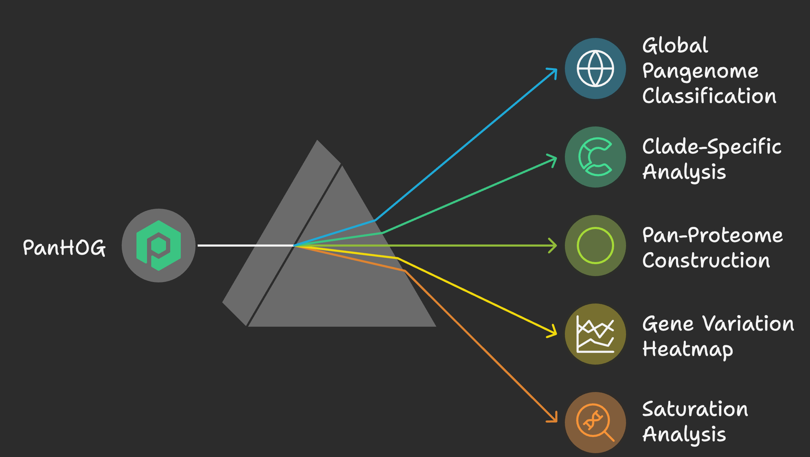
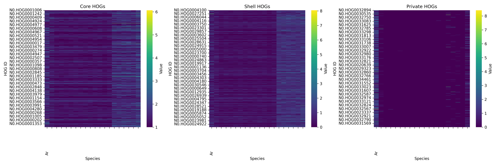
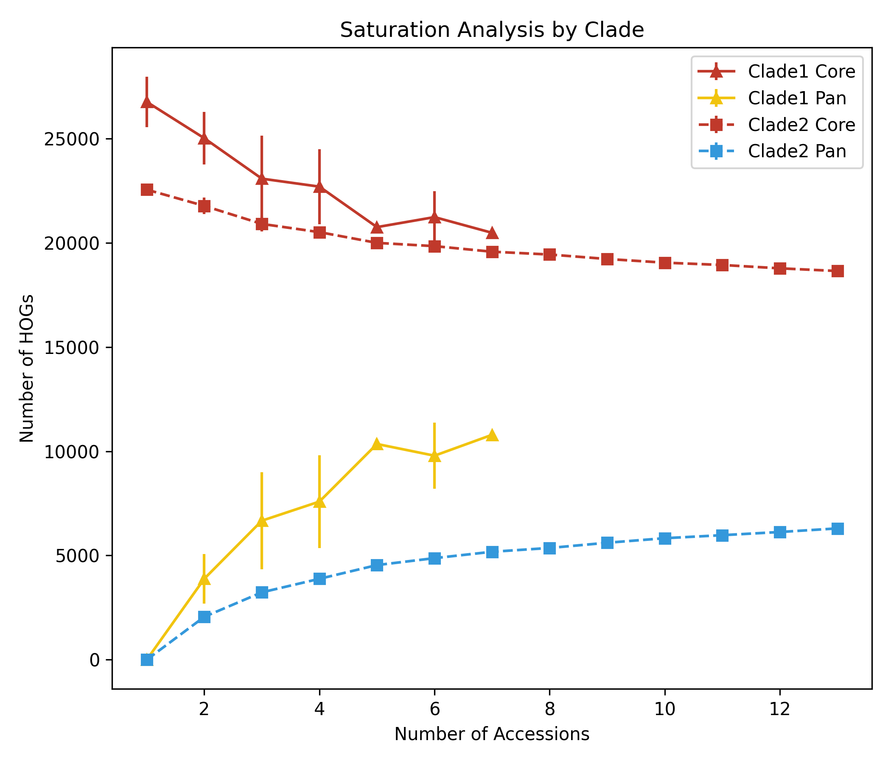

# PanHOG

<table>
<tr>
<td width="400">
  
</td>
<td>
A phylogeny-aware toolkit for classifying and annotating Hierarchical Orthologous Groups (HOGs) in pangenomic datasets. It's a flexible command-line toolkit for classifying HOGs across multiple genomes in a pangenome-aware, phylogeny-informed context. It supports core/shell/private gene classification, heatmap visualization, pan-proteome generation, functional annotation and saturation analysis. Now supports both command-line arguments and external configuration files.
</td>
</tr>
</table>
---


## 📢 Changelog

### [Released] - 2025-09-21

#### New Features

- **Functional Annotation (`--funano`)**: Added a major feature to perform functional annotation of pangenome compartments (core, shell, private, etc.) against the UniProt/Swiss-Prot database.
  - Supports annotation of all compartments (`--funano 1`) or specific ones (`--funano 2-6`).
  - Automatically downloads the database if a local copy is not provided via `--uniprot-db`.
  - Generates detailed annotation reports, raw BLAST results, and protein sequence files.
- **PAV and Count Matrix Generation**:
  - Added `--pav` flag to generate a Presence/Absence Variant (PAV) matrix.
  - Added `--matrix` flag to generate a gene copy number (Count) matrix.

#### Improvements

- **Restructured Output**: The output directory structure has been completely reorganized for better clarity. All results are now saved within a main `results/` directory, with sub-folders for `annotations/`, `blast_results/`, `peptides/`, and `compartments/`.
- **Organized Classification**: Pangenome classification files (`core.HOGs.tsv`, etc.) are now neatly stored in `results/compartments/panhog_classification/`.
- **Improved Cloud Gene File**: The `cloud.unassigned_genes.tsv` file now correctly includes a header.

## Key Features

* **Global Pangenome Classification (`--pan`)**
* **Clade-Specific Analysis (`--clade species1,species2`)**
* **Pan-Proteome Construction (`--proteome`)**
* **Gene Variation Heatmap (`--genevar`)**
* **Bootstrapped Saturation Analysis (`--saturation`)**
* **Clade-based Saturation Analysis (`--saturation-cladepair`)**
* **HOG-based Functional Annotation (`--funano`)**
* **Customizable via Config File (`--config config.yaml`)**
* **Pangene Integration for Gene Presence/Absence Analysis**

---

## Documentation
- [Install dependencies](Installation.md)
- [Configuration Guide](README_config.md) - Detailed guide for configuring PanHOG with YAML files
- [Pangene Integration Guide](README_pangene.md) - Instructions for using the pangene integration module


## ⚙️ Command-Line Options

PanHOG offers a wide range of options to customize your analysis. Here is a detailed breakdown:

### Main Arguments

| Argument | Description | Default |
|---|---|---|
| `--hog` | Path to the input HOGs TSV file (e.g., `N0.tsv`). | **Required** |
| `--fasta` | Path to the directory containing protein FASTA files. | **Required** |
| `-o`, `--output` | Directory where all results will be saved. | `.` (current dir) |
| `-p`, `--prefix` | A prefix to add to all output file names. | `""` (none) |
| `--config` | Path to a YAML configuration file for advanced settings. | `config.yaml` |

### Analysis Modes

| Argument | Description | Default |
|---|---|---|
| `--pan` | Performs a global pangenome classification across all species. | Enabled if `--clade` is not used. |
| `--clade` | Performs a pangenome classification on a specific subset of species. Provide a comma-separated list. | `None` |

### Functional Annotation

| Argument | Description | Default |
|---|---|---|
| `--funano` | Performs functional annotation against UniProt. Options: `0` (disabled), `1` (all), `2` (core), `3` (single-copy), `4` (shell), `5` (private), `6` (cloud). | `0` |
| `--uniprot-db` | Path to a local UniProt/Swiss-Prot FASTA file. If not provided, it will be downloaded automatically. | `None` |
| `--threads` | Number of CPU threads to use for the BLASTP search. | `4` |
| `--keep-uniprot` | If specified, the downloaded UniProt database will not be deleted after the run. | `False` |

### Downstream Analyses & Visualizations

| Argument | Description | Default |
|---|---|---|
| `--proteome` | Constructs a pan-proteome FASTA file. Use `--proteome` for all species or `--proteome sp1,sp2` for a subset. | `None` |
| `--genevar` | Generates a heatmap of gene copy number variation. Use `--genevar` for all species or `--genevar sp1,sp2` for a subset. | `None` |
| `--saturation` | Performs a bootstrapped saturation analysis to plot core and pan-genome growth. | `False` |
| `--saturation-cladepair`| Performs saturation analysis for two pre-defined clades (`--clade1`, `--clade2`) on the same plot. | `False` |
| `--zscore` | Applies Z-score normalization to the `--genevar` heatmap. | `False` |
| `--log` | Applies log2(count+1) transformation to the `--genevar` heatmap. | `False` |

### Output Matrices

| Argument | Description | Default |
|---|---|---|
| `--pav` | Generates a Presence/Absence Variant (PAV) matrix (1 for present, 0 for absent). | `False` |
| `--matrix` | Generates a gene copy number (Count) matrix. | `False` |

### Saturation Plot Customization

| Argument | Description | Default |
|---|---|---|
| `-b`, `--bootstrap` | Number of random sampling iterations for saturation analysis. | `100` |
| `--clade1` / `--clade2` | Comma-separated species lists for `--saturation-cladepair`. | (pre-defined lists) |
| `--marker-*` / `--color-*` | A range of options to customize markers and colors for saturation plots. | (various) |

---


---

## Basic Usage

```bash
python PanHOG.py --hog N0.tsv --fasta ./peptides/ --funano 0 --pan -o results/ -p run1_
#without functional annotation option (--funano 0)
```


```bash
python PanHOG.py --hog N0.tsv --fasta ./peptides/ --funano 5 --pan -o results/ -p run1_
#with functional annotation option for private HOGs (--funano 5)
```

### With clade-specific analysis:

```bash
python PanHOG.py --hog N0.tsv --fasta ./peptides/ \
  --clade Arabis_alpina,ET_AA21_2,ET_AA6 --pan -o results/ -p cladeA_
```

### With pan-proteome and gene variation heatmap:

```bash
python PanHOG.py --hog N0.tsv --fasta ./peptides/ \
  --proteome ALL --genevar ALL --zscore -o results/ -p viz_
```

---

## ⚙️ Configuration File

You can now use a YAML config file to set advanced parameters like colors, markers, labels, and clade definitions.

### Sample `config.yaml`

```yaml
bootstrap: 10000
marker_core_clade1: "^"
marker_core_clade2: "s"
marker_pan_clade1: "^"
marker_pan_clade2: "s"
color_core_clade1: "#c0392b"
color_pan_clade1: "#f1c40f"
color_core_clade2: "#c0392b"
color_pan_clade2: "#3498db"
clade1:
  - Arabis_alpina
  - AA1
  - AA2
....
clade2:
  - Col_PEK
  - Col-CEN
....
```

### Run using config:

```bash
python PanHOG.py --hog N0.tsv --fasta ./peptides/ --saturation-cladepair --config config.yaml
```

> Any command-line flag will **override** the corresponding config value.

---

## Output Files

* `core.HOGs.tsv`, `shell.HOGs.tsv`, `gt-specific.HOGs.tsv`, `single-copy.HOGs.tsv`
* `cloud.unassigned_genes.tsv`
* `private_genes_<species>.txt`
* `pan_proteome.fa`
* `genevar_heatmap.[png|pdf|svg]`

* `saturation_analysis.[png|pdf|svg]`

---

## Recommendations

* Use `--proteome` to extract FASTA of shared pangenes.
* Use `--saturation-cladepair` for insight into core/pan genome expansion across defined clades.
* Use `--genevar` with `--zscore` for population-scale expansions or contractions.

---

## Contact & Citation

This tool is currently in **beta**. For questions, contributions, or citation requests, please contact the developer or include the GitHub link in your reference.

---


Happy pangenomics with **PanHOG**! 🐼
