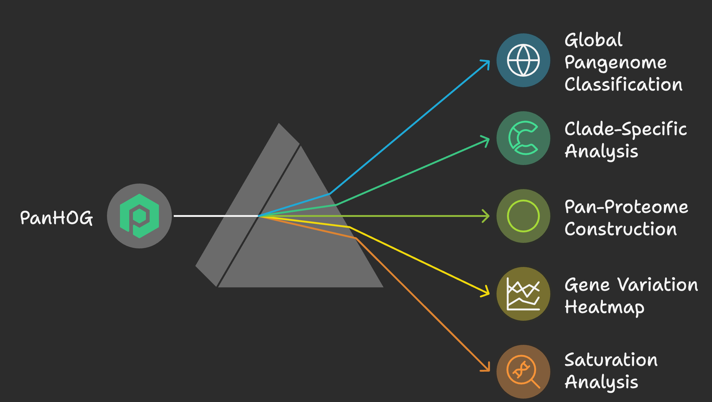

# PanHOG

[](#installation)
[](https://bioconda.github.io/)
[](#installation)
[](LICENSE)

<!-- After uploading, swap the badges above for the live channel version, e.g.:
[](https://anaconda.org/yykaya/panhog)
or, once on bioconda:
[](https://anaconda.org/bioconda/panhog) -->

<table>
<tr>
<td width="400">
  
</td>
<td>
A <b>phylogeny-aware</b> toolkit for classifying and annotating Hierarchical Orthologous Groups (HOGs) in pangenomic datasets. PanHOG classifies gene families into <b>core / shell / private</b> compartments, then goes beyond a raw presence/absence count: it re-weights the classification by the species tree, validates it with per-HOG gene trees and selection (dN/dS), functionally annotates the compartments, and produces publication-ready figures — all from an OrthoFinder <code>N0.tsv</code> plus per-accession FASTA.
</td>
</tr>
</table>

---

## Changelog

### [v0.4.0] - 2026-07-06

The phylogeny-aware release: the classification is no longer just a count — it is
cross-checked against the species tree, the gene trees, selection, and homology.

#### New features
- **Phylogeny-weighted classification (`--pan-weighted`)** — classify each HOG core/shell/private by the **fraction of total tree branch length its carriers span** (Faith's PD), not the raw count (thresholds `--pan-weighted-core` / `--pan-weighted-private`). Also writes per-clade compartments and a **`classification_confidence.tsv`** (frequency vs PD-weighted, per HOG) with the reclassified subset. All phylogeny outputs (LCA, gain/loss, PD-weighted, gene trees) go to a new **`phylogeny_weighted/`** directory with an in-directory `README.md`.
- **Gene-tree validation (`--gene-trees`)** — build a per-HOG **protein** ML tree (MAFFT → RAxML-NG) and, with `--cds`, a **codon tree** (better resolved at shallow divergence), compare them and score each HOG **Confirmed / Redundant / Conflict / Low-signal**. **Private** genes (no tree) are validated by **BLAST** against every other accession. Writes example tree plots and a `genetree_flagged.tsv`.
- **Compartment Ka/Ks (`--kaks-compartments N`)** — sample N HOGs per compartment, compute per-HOG dN/dS from codon alignments, and draw the classic core-vs-shell-vs-private **box plot** (Kruskal–Wallis). `--reference <accession>` gives a reference-vs-rest ("<accession> Ka/Ks") version.
- **Pangenome-composition summary + plots** — for both the frequency-based (`--pan`) and PD-weighted (`--pan-weighted`) classifications: a summary TSV, a **pie chart**, a **U-shaped occupancy histogram**, and a stacked bar — with the **raw plotted TSVs** so figures can be re-drawn.
- **Per-sample compartment files** — per-accession `core_HOGs_<sample>.tsv` / `shell_HOGs_<sample>.tsv` (+ genes, counts), like the existing private ones.
- **`--outgroup`** — exclude accessions (e.g. a distant outgroup that deflates "core") from all analyses and plots.

#### Fixes
- **Per-HOG dN/dS estimator** — now the **ratio of means** `mean(dN)/mean(dS)`. The previous mean-of-per-pair-ratios was dominated by near-zero-dS pairs (codeml caps ω at 99) and grossly over-estimated per-HOG dN/dS; it is kept only as `dN_dS_mean_of_ratios`.
- **Per-species counts** in `--summary` and `--random-hog-matrix` — an off-by-index bug that read the last accessions as absent/0 is fixed.
- **Copy-number annotation-bias `[WARNING]`** — `--genevar` warns when one accession's mean copy number ≫ the rest (usually reference lift-over vs de-novo annotation, not biology).

### [v0.3.0] - 2026-07-01

- **Correct Ka/Ks (dN/dS)** — replaces the broken built-in Nei–Gojobori routine; delegated to validated engines via **`--kaks-method`**: `biopython` (`--kaks-model` NG86/LWL85/YN00/ML), **`codeml`** (PAML pairwise), or `kakscalculator`. Undefined values are reported as `NaN`; writes a per-HOG summary and a per-pair table.
- **Phylogeny-aware analysis (`--species-tree`)** — deterministic internal-node naming + annotated Newick tree, species/tip validation, HOG→LCA mapping with a **Faith's PD fraction**, and **Dollo-parsimony gain/loss** per branch.
- **Modern BioPython compatibility** (≥1.85) and **packaging** — ships all helper modules, `pyproject.toml`, a conda recipe, and a `pytest` suite.

<details>
<summary><b>[v0.2.0] - 2026-02-27</b></summary>

#### New Features
- **Summary Statistics (`--summary`)**: summary table + stacked bar of Gene/HOG ratios across compartments.
- **Random HOG Matrix (`--random-hog-matrix N`)**: absent/single/multi-copy heatmap for N random HOGs.
- **Ka/Ks Analysis (`--kaks`)**: codon-based dN/dS (Nei-Gojobori 1986); `--kaks-type`, `--aligner` (mafft/muscle), `--backtrans` (naive/pal2nal), optional `--reference`.
- **Phylogenetic LCA Analysis (`--species-tree`)**: maps HOGs to their LCA on a species tree.
- **Supermatrix Generation (`--supermatrix`)**: concatenated single-copy orthologs + partition file for RAxML/IQ-TREE.
- **Configurable Tool Paths**: `--mafft-path`, `--muscle-path`, `--pal2nal-path`, `--blastp-path`, `--makeblastdb-path`, `--kakscalculator-path`.

#### Improvements
- Graceful optional-dependency handling; extended FASTA support (`.pep.fa`, uppercase); conda packaging; updated config examples.

</details>

<details>
<summary><b>[Released] - 2025-09-21</b></summary>

#### New Features
- **Functional Annotation (`--funano`)**: annotate compartments against UniProt/Swiss-Prot (`--funano 1` = all, `2-6` = specific); auto-downloads the DB if `--uniprot-db` is not given.
- **PAV / Count matrices**: `--pav` (presence/absence), `--matrix` (copy number).

#### Improvements
- Restructured output under `results/` (`annotations/`, `blast_results/`, `peptides/`, `compartments/`); classification files under `results/compartments/panhog_classification/`; cloud-gene file gains a header.

</details>

---

## Key Features

| Feature | Flag | Description |
|---|---|---|
| Pangenome classification | `--pan` | Core / single-copy / shell / private / cloud + **pie, U-shaped histogram, stacked bar** |
| Exclude outgroup | `--outgroup sp1,...` | Drop accessions (e.g. outgroups) from all analyses & plots |
| Clade-specific analysis | `--clade sp1,...` | Restrict analysis to a subset of accessions |
| Summary statistics | `--summary` | Per-compartment counts + stacked bar |
| Gene-variation heatmap | `--genevar` | Copy-number heatmap (with annotation-bias warning) |
| Pan-proteome FASTA | `--proteome` | Concatenated pan-proteome (all accessions or a subset) |
| PAV / Count matrices | `--pav` / `--matrix` | Presence/absence & copy-number matrices |
| Random HOG matrix | `--random-hog-matrix N` | Absent/single/multi heatmap of N random HOGs |
| Saturation analysis | `--saturation` | Bootstrapped core/pan growth curves |
| Functional annotation | `--funano` | BLAST-based annotation vs UniProt/Swiss-Prot |
| Ka/Ks (dN/dS) | `--kaks` | Codon-based selection (biopython / PAML codeml / KaKs_Calculator) |
| **Compartment Ka/Ks** | `--kaks-compartments N` | Box plot of per-HOG dN/dS across core/shell/private |
| **Phylogeny-aware** | `--species-tree` | HOG→LCA + PD fraction + Dollo gain/loss |
| **PD-weighted classification** | `--pan-weighted` | Core/shell/private by PD fraction + clade compartments + confidence |
| **Gene-tree validation** | `--gene-trees` | Per-HOG protein + codon ML trees + private-gene BLAST |
| Supermatrix | `--supermatrix` | Concatenated single-copy orthologs for phylogenomics |
| Config file | `--config` | YAML-based configuration |

---

## Installation

### Conda (recommended)
```bash
conda env create -f environment.yml     # numpy, pandas, biopython, scipy,
conda activate panhog                    # mafft, muscle, pal2nal, paml, blast,
pip install .                            # raxml-ng, modeltest-ng, ete3 + PanHOG
```

### Pip
```bash
pip install panhog          # Python deps only; install mafft/raxml-ng/blast/paml separately
```

### From source (development)
```bash
git clone https://github.com/yykaya/PanHOG.git
cd PanHOG
pip install -e ".[dev]"     # editable + scipy/pytest (scipy enables YN00/ML dN/dS)
pytest                       # run the test suite
```
After install, the `panhog` and `pangenehog` commands are available.

**External tools by feature:** `mafft`/`muscle` (Ka/Ks, gene trees, supermatrix), `raxml-ng` (`--gene-trees`), `paml` codeml (`--kaks-method codeml`), `blast` (`--funano`, private-gene validation), `ete3` (gene-tree RF distances), `pal2nal` (`--backtrans pal2nal`).

---

## Quick start

> In the examples, `outgroup_acc` / `ref_acc` / `acc1,acc2,...` are placeholders —
> substitute your own accession names (they must match the column names in `N0.tsv`).

### Basic pangenome classification (+ pie / U-shaped histogram / stacked bar)
```bash
panhog --hog N0.tsv --fasta peptides/ --pan -o results/ -p run1_
```

### Full pipeline with all core analyses
```bash
panhog --hog N0.tsv --fasta peptides/ --pan \
  --proteome ALL --genevar ALL --saturation \
  --pav --matrix --summary --random-hog-matrix 1000 \
  -o results/ -p full_
```

### Exclude a distant outgroup (so it doesn't deflate "core")
```bash
panhog --hog N0.tsv --fasta peptides/ --pan --outgroup outgroup_acc -o results/ -p ingroup_
```

### Ka/Ks selection analysis
```bash
panhog --hog N0.tsv --fasta peptides/ --pan \
  --kaks --cds cds/ --kaks-type core \
  --aligner mafft --backtrans naive \
  -o results/ -p kaks_
```

### Compartment Ka/Ks box plot (core vs shell vs private)
```bash
panhog --hog N0.tsv --fasta peptides/ --cds cds/ --pan \
  --kaks-compartments 100 --reference ref_acc \
  -o results/ -p kaks_
```

### Phylogenetic LCA analysis
```bash
panhog --hog N0.tsv --fasta peptides/ --pan \
  --species-tree species_tree.nwk \
  -o results/ -p phylo_
```

### Phylogeny-weighted classification + confidence (frequency vs PD-weighted)
```bash
panhog --hog N0.tsv --fasta peptides/ --pan \
  --species-tree species_tree.nwk --pan-weighted \
  -o results/ -p phylo_
```

### Gene-tree validation of the compartments (protein + codon trees + private BLAST)
```bash
panhog --hog N0.tsv --fasta peptides/ --cds cds/ --pan \
  --species-tree species_tree.nwk --gene-trees --gene-trees-per-class 5 \
  -o results/ -p phylo_
```

### Functional annotation of a compartment (here: shell)
```bash
panhog --hog N0.tsv --fasta peptides/ --pan --funano 4 -o results/ -p shell_
```

### Clade-specific analysis
```bash
panhog --hog N0.tsv --fasta peptides/ \
  --clade acc1,acc2,acc3 -o results/ -p cladeA_
```

### With a YAML config file
```bash
panhog --hog N0.tsv --fasta peptides/ --config config.yaml
```

### Pangene annotation pipeline
```bash
pangenehog --hog N0.tsv --fasta peptides/ --pan -o results/
```

### Everything at once
```bash
panhog --hog N0.tsv --fasta peptides/ --cds cds/ --species-tree species_tree.nwk \
  --pan --summary --genevar ALL --proteome ALL --pav --matrix --random-hog-matrix 500 \
  --saturation --pan-weighted --gene-trees --kaks-compartments 100 --supermatrix \
  --outgroup outgroup_acc -o results/ -p full_
```

---

## Command-line options

**Inputs / output**

| Flag | Description | Default |
|---|---|---|
| `--hog` | OrthoFinder `N0.tsv` (required) | — |
| `--fasta` | Directory of per-accession **peptide** FASTA | — |
| `--cds` | Directory of per-accession **CDS** FASTA (Ka/Ks, codon trees) | `None` |
| `--output` / `-o` | Output directory | — |
| `--prefix` / `-p` | Output file prefix | `""` |
| `--config` | YAML config file | `config.yaml` |

**Classification & filtering**

| Flag | Description | Default |
|---|---|---|
| `--pan` | Global core/shell/private classification (+ summary plots) | off |
| `--clade sp1,sp2,...` | Restrict to a subset of accessions | `None` |
| `--outgroup sp1,...` | **Exclude** accessions from all analyses/plots | `None` |
| `--summary` | Per-compartment summary table + bar chart | off |
| `--genevar [ALL\|sp1,..]` | Copy-number heatmap (all accessions or a subset) | off |
| `--zscore` | Row z-score normalise the copy-number heatmap | off |
| `--proteome [ALL\|sp1,..]` | Build a pan-proteome FASTA (all accessions or a subset) | off |
| `--pav` / `--matrix` | Presence/absence & copy-number matrices | off |
| `--random-hog-matrix N` | Heatmap of N random HOGs | off |
| `--saturation` | Bootstrapped core/pan growth curves | off |

**Phylogeny-aware**

| Flag | Description | Default |
|---|---|---|
| `--species-tree` | Newick species tree → LCA + PD + Dollo (in `phylogeny_weighted/`) | `None` |
| `--pan-weighted` | PD-weighted core/shell/private + clade compartments + confidence | off |
| `--pan-weighted-core` / `--pan-weighted-private` | PD-fraction thresholds | `0.9` / `0.1` |
| `--supermatrix` | Concatenate single-copy orthologs (+ partitions) | off |

**Gene-tree validation**

| Flag | Description | Default |
|---|---|---|
| `--gene-trees` | Per-HOG protein (+ codon, with `--cds`) ML trees + private BLAST | off |
| `--gene-trees-per-class` | Candidate HOGs per compartment | `3` |
| `--gene-tree-hogs` | Comma-separated HOG IDs (override auto-selection) | `None` |
| `--gene-tree-model` / `--gene-tree-codon-model` | RAxML-NG protein / codon model | `LG+G` / `GTR+G` |
| `--gene-tree-bs` | Bootstrap replicates | `100` |
| `--raxml-ng-path` | Path to RAxML-NG | `raxml-ng` |

**Ka/Ks (dN/dS)**

| Flag | Description | Default |
|---|---|---|
| `--kaks` | Per-HOG dN/dS on a compartment | off |
| `--kaks-type` | `core` / `shell` / `private` / `all` | `core` |
| `--kaks-method` | `biopython` / `codeml` / `kakscalculator` | `biopython` |
| `--kaks-model` | biopython sub-model: `NG86` / `LWL85` / `YN00` / `ML` | `NG86` |
| `--reference` | Reference accession → reference-vs-rest pairing | `None` |
| `--aligner` / `--backtrans` | `mafft`/`muscle` ; `naive`/`pal2nal` | `mafft` / `naive` |
| `--kaks-compartments N` | Sample N HOGs/compartment → dN/dS box plot | `0` (off) |
| `--kaks-compartments-maxseqs` | Skip HOGs with more sequences than this | `12` |

**Functional annotation & tool paths**

| Flag | Description | Default |
|---|---|---|
| `--funano {0..6}` | Annotate compartments vs UniProt (1=all, 2=core, 3=single-copy, 4=shell, 5=private, 6=cloud) | `0` |
| `--uniprot-db` | Local UniProt FASTA (else auto-download) | `None` |
| `--mafft-path` / `--muscle-path` / `--pal2nal-path` / `--codeml-path` / `--blastp-path` / `--makeblastdb-path` / `--kakscalculator-path` | Custom tool paths | tool name |

---

## Output structure

```
results/compartments/
├── panhog_classification/
│   ├── <p>core.HOGs.tsv, <p>shell.HOGs.tsv, <p>gt-specific.HOGs.tsv, ...
│   ├── <p>{core,shell,single-copy}_HOGs_<sample>.tsv   (per-accession views)
│   ├── <p>pangenome_summary.tsv + pie / occupancy_histogram / stacked_bar   (+ raw TSVs)
│   └── <p>private_HOGs_<sample>.tsv, ...
├── <p>PAV.tsv, <p>CountMatrix.tsv, <p>summary_stats.tsv, <p>genevar_heatmap.png, ...
├── <p>kaks_by_compartment.tsv/.png, <p>kaks_results_<type>.tsv, ...
└── phylogeny_weighted/                       ← --species-tree / --pan-weighted
    ├── README.md                             (explains every file + PD_Fraction)
    ├── <p>hog_lca_analysis.tsv, <p>hog_gainloss.tsv, <p>phylo_node_summary.tsv
    ├── <p>hog_pd_weighted_class.tsv, <p>clade_compartments.tsv
    ├── <p>classification_confidence.tsv, <p>reclassified_HOGs.tsv
    ├── <p>pangenome_summary.tsv + pie / occupancy_histogram / stacked_bar
    ├── <p>genetree_validation.tsv, <p>genetree_flagged.tsv
    └── gene_trees/  (*.raxml.support + example tree plots)
```

---

## Phylogeny-aware classification, in one line each
- **Frequency** (`--pan`): core = present in all accessions, private = 1, shell = in between.
- **PD-weighted** (`--pan-weighted`): re-rank by the **fraction of tree branch length** the carriers span — a gene in 11/12 accessions that spans ≥90 % of the tree is really core; `classification_confidence.tsv` tells you which HOGs the count and the phylogeny agree/disagree on.
- **Gene-tree** (`--gene-trees`): does each HOG's own tree confirm the grouping? `Conflict` = probably not clean orthologs.
- **Selection** (`--kaks-compartments`): core should be under the strongest purifying selection (lowest dN/dS).

Full guidance: **[docs/CLASSIFICATION_GUIDANCE.md](docs/CLASSIFICATION_GUIDANCE.md)** · PD outputs **[docs/PHYLOGENY_WEIGHTED.md](docs/PHYLOGENY_WEIGHTED.md)** · gene trees **[docs/GENETREE_VALIDATION.md](docs/GENETREE_VALIDATION.md)** · heatmap normalisation **[docs/HEATMAP_NORMALISATION.md](docs/HEATMAP_NORMALISATION.md)**.

---

## Configuration file
All flags can be set in a YAML config (`--config config.yaml`); see `example1.config.yaml` / `example2.config.yaml` and [README_config.md](README_config.md). The companion **`pangenehog`** pangene-annotation pipeline is documented in [README_pangene.md](README_pangene.md).

## Contact & citation
Yasin Kaya — https://github.com/yykaya/PanHOG · MIT License.
